# Menggunakan XAMPP
1. Buka aplikasi XAMPP
2. Klik `<star>` di MYSQL
3. Klik `<Shell>`
4. Masuk kedatabase dengan akun administrator `<mysql -u root -p>`
	password kosong jadi silahkan langsung enter
1. Buat Database
- Create Database
2. Tampilkan Database
- `<show database>`
3. Hentikan Database
- `<drop database [nama_database]`
4. Menggunakan Database
- `<use [nama_database]`
## Referensi video youtube
https://youtu.be/3UN1ZNvqEt8?si=tAbr0KJ1D1S3iKwG
# Penggunaan Awal MySQL
- Query 
`<mysql -u root -p>`

### Hasil
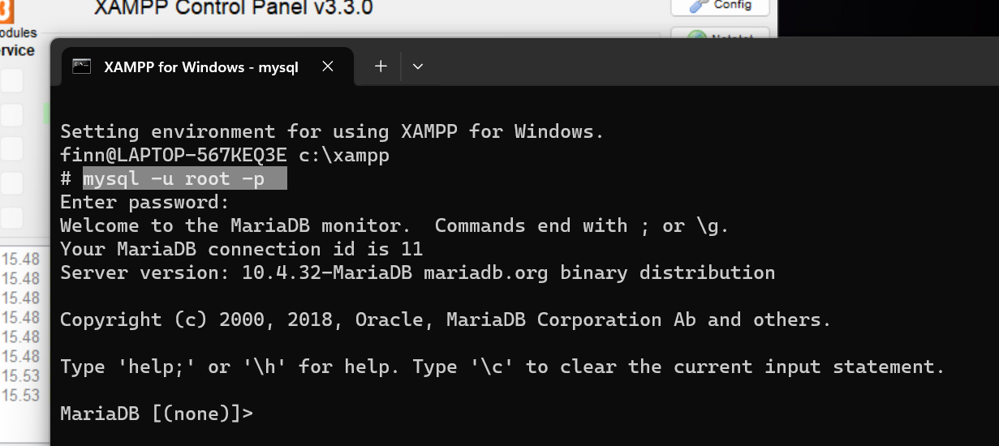
### Analisis
- `<mySQL>` Salah satu aplikasi database server dengan bahasa pemrograman structured query languange `(SQL)` yang berfungsi untuk mengelola data secara terstruktur dan sistematis.
- `<-u root>` Bagian ini mengeset pengguna (user) yang akan digunakan saat terhubung ke server  MYSQL. Dalam contoh ini, pengguna yang digunakan adalah `"root"`. Pengguna `"root"` biasanya memiliki hak akses penuh ke server MYSQL dan dapat melakukan tindakan administratif.
- `<-p>` Opsi ini digunakan untuk meminta kata sandi (password) setelah perintah dijalankan ini adalah langkah keamanan yang umum digunakan untuk memastikan hanya pengguna yang sah yang dapat mengakses server MYSQL. Setelah kita menekan Enter setelah perintah ini, kita akan diminta memasukkan kata sandi untuk pengguna `"root"`.
### Kesimpulan
Perintah `mysql -u root -p` digunakan untuk masuk ke sistem manajemen basis data MySQL dengan mengidentifikasi pengguna (user) 'root' dan meminta kata sandi (password) secara interaktif.

# DataBase
Database (basis data) adalah kumpulan terstruktur dari informasi yang disimpan secara elektronik dalam sistem komputer. Database dirancang untuk menyimpan, mengatur, dan mengelola data dengan cara yang efisien dan dapat diakses.
## Buat DataBase
Database adalah sekumpulan data yang dikelola berdasarkan ketentuan tertentu yang saling berkaitan sehingga memudahkan dalam pengelolahannya.
### Struktur Query
```mysql
create databases [nama_tabel];
```
### Contoh Query
```
create databases XI_RPL_1;
```
### Hasil 
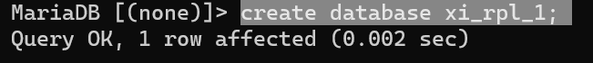
### Analisis 
- `CREATE DATABASE` adalah perintah untuk membuat database baru.
- `XI_RPL_1` adalah nama yang Anda pilih untuk database baru Anda. Tanda kurung siku `<("[]")>` digunakan di sini untuk menghindari kesalahan jika nama database mengandung karakter spesial atau spasi. Namun, perlu dicatat bahwa tidak semua DBMS mengizinkan penggunaan tanda kurung siku dalam nama database, jadi pastikan untuk menyesuaikan sintaksdengan DBMS yang Anda gunakan.
### Kesimpulan
Kesimpulan dari perintah `"CREATE DATABASE XI_RPL_1;"` adalah bahwa perintah tersebut digunakan untuk membuat sebuah database baru dengan nama `"XI_RPL_1"` .
## Tampilkan DataBase

### Struktur Query
```
show [nama_databases];
```
### Contoh Query
```mysql
show databases;
```
### Hasil 
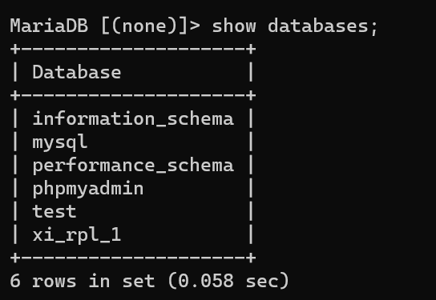
### Analisis 
`SHOW DATABASE` digunakan untuk menampilkan daftar database yang ada dalam sistem manejemen basis data (DBMS). Perintah ini dapat digunakan di beberapa DBMS seperti MYSQL, PostgreSQL, dan beberapa DBMS lainnya. Namun, perintahnya dapat sedikit berbeda tergantung.
### Kesimpulan
Kesimpulan dari perintah `"SHOW DATABASES;"` adalah bahwa perintah tersebut digunakan untuk menampilkan daftar database yang ada dalam sistem manajemen basis data yang sedang digunakan. Perintah ini akan menghasilkan output berupa daftar nama-nama database yang tersedia.
## Hapus DataBase
### Struktur Query
```
drop database [nama_dataasbe]
```
### Contoh Query
```mysql
drop database xi_rpl_1;
```
### Hasil :
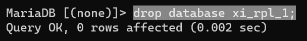
### Analisis 
`<DROP DATABASE [nama_database]>` digunakan dalam sistem manajemen basis data (DBMS) untuk menghapus sebuah database beserta semua objek yang terkait dengan database tersebut, seperti tabel, indeks, tampilan, prosedur tersimpan, dan lain-lain.
### Kesimpulan
Kesimpulan dari perintah `"DROP DATABASE XI_RPL_1;"` adalah bahwa perintah tersebut digunakan untuk menghapus database dengan nama `"XI_RPL_1"` dari sistem manajemen basis data yang sedang digunakan.
## Gunakan DataBase
### Struktur Query
```
use [nama_database]
```
### Contoh Query
```mysql
use xi_rpl_1;
```
### Hasil :
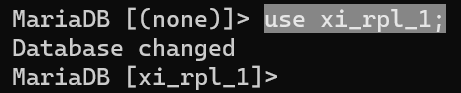
### Analisis 
`USE [nama_database]` digunakan dalam sistem manajemen basis data (DBMS) untuk beralih atau memilih database yang akan digunakan. Ketika Anda menggunakan perintah `<USE>` diikuti dengan nama database, DBMS akan mengarahkan semua perintah dan operasi selanjutnya pada database yang ditentukan.
### Kesimpulan
Kesimpulan dari perintah `"USE XI_RPL_1;"` adalah bahwa perintah tersebut digunakan untuk memilih atau beralih ke database dengan nama `"XI_RPL_1"` dalam sistem manajemen basis data yang sedang digunakan.
# Tipe Data
## Angka
- Tipe data ini digunakan untuk merepresentasikan bilangan bulat tanpa bagian desimal.
- Contoh: 0, 42, -10
## Teks
- Tipe data ini digunakan untuk merepresentasikan bilangan dengan bagian desimal.
- Contoh: 3.14, 2.5, -0.5
## Tanggal
- `Date` digunakan untuk menyimpan informasi tentang tanggal, biasanya terdiri dari hari, bulan, dan tahun seperti 30 Januari 2024
- `Time` digunakan untuk menyimpan informasi tentang waktu dalam sehari, biasanya terdiri dari jam, menit, detik, dan milidetik seperti 14:30:45.500
- `DateTime` menggabungkan informasi tanggal dan waktu dalam satu objek, biasanya terdiri dari hari, bulan, tahun, jam, menit, detik, dan milidetik seperti 30 Januari 2024 14:30:45.500
## Boolean
- Tipe data ini hanya memiliki dua nilai yang mungkin, yaitu `true` (benar) dan `false` (salah).
## Tipe Data Pilihan
- Enum
- Set
# Tabel
## Buat Tabel
### Struktur Query
```mysql
create table [nama table](
namakolom_1 tipedata(lebar) cons,
namakolom_2 tipedata(lebar) cons,
namakolom_3 tipedata(lebar) cons,
)
```
### Contoh Query
```mysql
nama_mobil varchar(15) primary key not null,
plat_mobil char(18) not null unique,
warna_mobil varchar(18) not null unique);
```
### Hasil
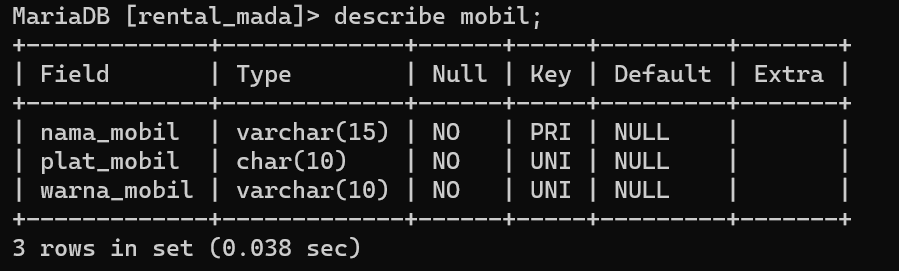
### Analisis
1. `nama_mobil varchar(15) primary key not null`: Ini adalah kolom dengan nama "nama_mobil" yang memiliki tipe data VARCHAR dengan panjang maksimum 15 karakter. Primary key menandakan bahwa kolom ini akan berfungsi sebagai kunci utama untuk mengidentifikasi setiap baris dalam tabel. "Not null" menunjukkan bahwa kolom tidak boleh memiliki nilai null, yang berarti setiap baris harus memiliki nilai yang valid untuk kolom ini.
2. `plat_mobil chat(18) not null unique`: Ada beberapa kesalahan ketik dalam definisi kolom ini. Saya berasumsi bahwa maksud Anda adalah `plat_mobil char(18) not null unique`. Kolom ini memiliki nama "plat_mobil" dan menggunakan tipe data CHAR dengan panjang tetap 18 karakter. "Not null" menunjukkan bahwa kolom ini tidak boleh memiliki nilai null. "Unique" menandakan bahwa setiap nilai dalam kolom harus unik, artinya tidak ada dua baris dalam tabel yang memiliki nilai yang sama untuk kolom ini.
3. `warna_mobil varchar(18) not null unique`: Ini adalah kolom dengan nama "warna_mobil" yang menggunakan tipe data VARCHAR dengan panjang maksimum 18 karakter. "Not null" menunjukkan bahwa kolom ini tidak boleh memiliki nilai null. "Unique" menandakan bahwa setiap nilai dalam kolom harus unik, sehingga tidak ada dua baris dalam tabel yang memiliki nilai yang sama untuk kolom ini.
### Kesimpulan
1. nama_mobil varchar(15) primary key not null,
- Tipe data: VARCHAR(15), Atribut: Primary key (utama), tidak dapat bernilai NULL (not null). Kolom ini digunakan sebagai kunci utama (primary key) untuk tabel dan harus diisi dengan nilai yang unik. Panjang karakter maksimum adalah 15.
2. plat_mobil chat(18) not null unique
- Tipe data: CHAR(18), Atribut: Tidak dapat bernilai NULL (not null), harus memiliki nilai unik (unique). Kolom ini harus diisi dan memuat nilai unik dengan panjang karakter tetap sebanyak 18 karakter.
3. warna_mobil varchar(18) not null unique,
- Tipe data: VARCHAR(18), Atribut: Tidak dapat bernilai NULL (not null), harus memiliki nilai unik (unique). Kesimpulan: Kolom ini harus diisi dan memuat nilai unik dengan panjang karakter maksimum sebanyak 18.
## Tampilkan Struktur Tabel

### Struktur Query
```mysql
desc [nama_table];
```
### Contoh Query
```mysql
desc pelanggan;
```
### Hasil
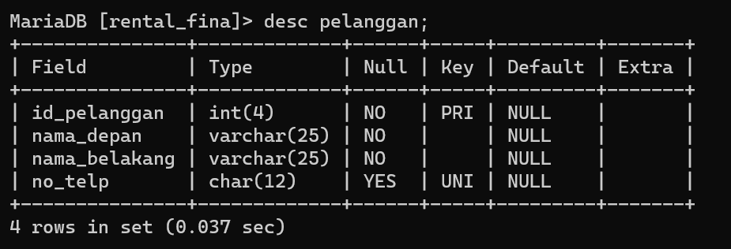

### Analisis
`desc pelanggan;`: dapat melihat secara detail karakteristik dari setiap kolom dalam tabel tersebut, termasuk nama kolom, tipe data, panjang maksimum (jika berlaku), dan konstrain khusus seperti PRIMARY KEY, UNIQUE, atau NOT NULL yang diterapkan pada setiap kolom.
### Kesimpulan
perintah tersebut memberikan gambaran tentang bagaimana tabel "Pelanggan" telah didefinisikan dalam basis data.
## Menampilkan Tabel

### Struktur Query
```mysql
show tables;
```
### Contoh Query
```mysql
show tables;
```
### Hasil
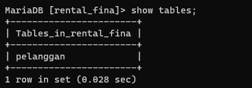
### Analisis
`show tables;`: untuk menampilkan semua tabel yang ada dalam database yang sedang aktif.
### Kesimpulan
Perintah `"SHOW TABLES;"` akan menghasilkan output berupa daftar nama-nama tabel yang tersedia dalam database yang sedang digunakan. Output ini memberikan informasi tentang tabel-tabel yang ada dalam database dan memungkinkan pengguna untuk melihat struktur dan konten data dalam tabel-tabel tersebut.
# QnA

> [! faq]- Mengapa hanya kolom id_pelanggan yang menggunakan constraint PRIMARY KEY? 
>  >kolom id_pelanggan menggunakan constraint PRIMARY KEY karena dianggap sebagai atribut yang unik dan mengidentifikasi secara unik setiap baris dalam tabel pelanggan. Constraint PRIMARY KEY digunakan untuk memastikan bahwa tidak ada nilai yang duplikat atau NULL dalam kolom tersebut.

> [!faq]- Mengapa pada kolom no_telp yang menggunakan tipe data char bukan varhar?
> 
> > tipe data char atau varchar untuk kolom no_telp tergantung pada kebutuhan dan karakteristik data yang akan disimpan dalam kolom tersebut.

> [!faq]- Mengapa hanya kolom no_telp yang menggunakan constraint UNIQUE?
> 
> > Kolom no_telp menggunakan constraint UNIQUE karena dianggap harus memiliki nilai yang unik di setiap baris dalam tabel. dalam menggunakan constraint UNIQUE pada kolom no_telp memastikan bahwa tidak ada dua pelanggan dengan nomor telepon yang sama.

> [!faq]- Mengapa kolom no_telp tidak memakai constraint NOT NULL, sementara kolom lainnya menggunakan constraint tersebut? 
> > pada kolom seperti no_telp, ada situasi di mana nomor telepon mungkin tidak tersedia atau tidak diketahui untuk beberapa pelanggan. Dalam kasus ini, memaksa kolom no_telp menggunakan constraint NOT NULL akan menjadi tidak praktis dan dapat membatasi fleksibilitas data.

> [!faq]- Perbedaan PK  & UNIQUE?
> > PK digunakan untuk mengidentifikasi secara unik setiap baris dalam tabel. Setiap tabel biasanya memiliki satu PRIMARY KEY yang berfungsi sebagai pengenal utama untuk baris-baris tersebut.
> 
> > UNIQUE digunakan untuk memastikan bahwa setiap nilai dalam kolom tertentu adalah unik, tetapi tidak digunakan untuk mengidentifikasi secara unik setiap baris dalam tabel.

# Insert
## Insert 1 data
### Struktur
```mysql
INSERT INTO [nama_tabel]
VALUES (nilai1, nilai2, nilai3, ...);
```
### Contoh
```mysql
INSERT INTO pelanggan
values (1, "mada", "jeno", "082195305736");
```
### Hasil
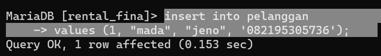
### Analisis
1. Kolom pertama: mungkin merupakan kolom ID pelanggan dengan tipe data numerik.
2. Kolom kedua: mungkin merupakan kolom nama dengan tipe data teks.
3. Kolom ketiga: mungkin merupakan kolom nama belakang dengan tipe data teks.
4. Kolom keemp
5. 
6.at: mungkin merupakan kolom nomor telepon dengan tipe data teks.
`INSERT INTO` akan menyisipkan nilai-nilai yang Anda berikan ke dalam tabel "pelanggan" sesuai dengan urutan kolom yang ada. Pastikan bahwa struktur tabel "pelanggan" sudah sesuai dengan urutan dan tipe data yang digunakan dalam perintah tersebut.
### Kesimpulan
`INSERT INTO pelanggan` `VALUES (1, "mada", "jeno", "082195305736");`, dapat disimpulkan bahwa Anda sedang mencoba menyisipkan satu baris data baru ke dalam tabel "pelanggan". Jika struktur tabel "pelanggan" benar dan sesuai dengan perintah tersebut, maka data baru dengan nilai-nilai yang Anda berikan akan dimasukkan ke dalam tabel "pelanggan".
## Insert > 1 data
### Struktur
```mysql
Insert into [nama_table]
Values (nilai1, nilai2, nilai3, nilai4)
       (nilai1, nilai2, nilai3, nilai4)
       (nilai1, nilai2, nilai3, nilai4)
```
### Contoh
```mysql
insert into pelanggan
values (5, "mada", "jeno", '0835515796087'),
(4, "rafia", "nolan", '084255669897'),
(3, "gusion", "yusin", '08646903215');
```
### Hasil
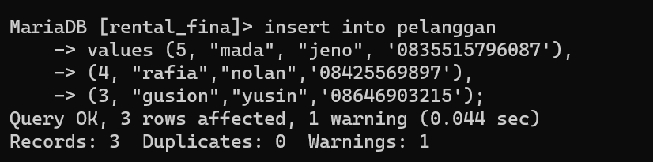
### Analisis
- `INSERT INTO pelanggan`: Menentukan bahwa Anda ingin memasukkan data ke dalam tabel "pelanggan".
- `VALUES`: Menunjukkan bahwa Anda memberikan nilai untuk dimasukkan ke dalam kolom yang ditentukan.
- Nilai dalam tanda kurung mewakili masing-masing baris yang akan dimasukkan ke dalam tabel "pelanggan".
- Baris pertama memiliki nilai `5, "mada", "jeno", '0835515796087'`.
- Baris kedua memiliki nilai `4, "rafia", "nolan", '084255669897'`.
- Baris ketiga memiliki nilai `3, "gusion", "yusin", '08646903215'`.
### Kesimpulan
Baris pertama memiliki nilai ID 5, nama depan "mada", nama belakang "jeno", dan nomor telepon '0835515796087'. Baris kedua memiliki nilai ID 4, nama depan "rafia", nama belakang "nolan", dan nomor telepon '084255669897'. Baris ketiga memiliki nilai ID 3, nama depan "gusion", nama belakang "yusin", dan nomor telepon '08646903215'.
# Select
## Seluruh Data
### Struktur
```mysql
select * from [nama_tabel];
```
### Contoh
```mysql
select * from pelanggan;
```
### Hasil
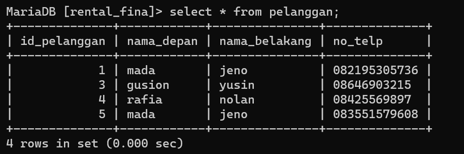
### Analisis
Kueri SQL "SELECT * FROM pelanggan;" adalah query sederhana yang digunakan untuk mengambil semua kolom dan record dari tabel bernama "pelanggan" dalam database. Izinkan saya menguraikan pertanyaannya untuk Anda:
- `SELECT *` : digunakan untuk memilih semua kolom dari tabel yang ditentukan. 
- `FROM pelanggan` : Bagian ini menentukan tabel untuk mengambil data. Dalam tabelnya diberi nama "pelanggan".
### Kesimpulan
program akan mengambil dan menampilkan semua data yang tersimpan dalam tabel Pelanggan, termasuk setiap kolom dan setiap baris yang ada dalam tabel tersebut.
## Data Kolom Tertentu
### Struktur
```mysql
select [nama_kolom1], [nama_kolom2],...,[nama_kolom_n]
from [nama_tabel],
```
### Contoh
```mysql
select nama_depan from pelanggan;
```
### Hasil
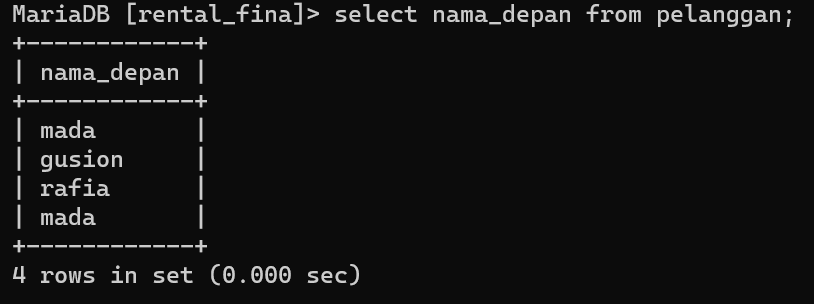
### Analisis
- `Select` merupakan query yang digunakan untuk menampilkan hasil `insert`
- `nama_depan` nama kolom dalam tabel database yang mungkin menyimpan informasi tentang nama depan dari pelanggan.
- `from` query yang digunakan untuk memberikan penanda bahwa table mana yang akan di tampilkan
- `pelanggan` merupakan nama table yang isi nya akan di tampilkan
### Kesimpulan
Hasilnya akan berupa daftar `nama_depan` dari semua pelanggan yang terdaftar dalam tabel tersebut.
## Klausa WHERE
### Struktur
```mysql
select [nama_kolom/*] from [nama_tsbel]
where [kondisi];
```
### Contoh
```mysql
select nama_depan from pelanggan
where id =2;
```
### Hasil
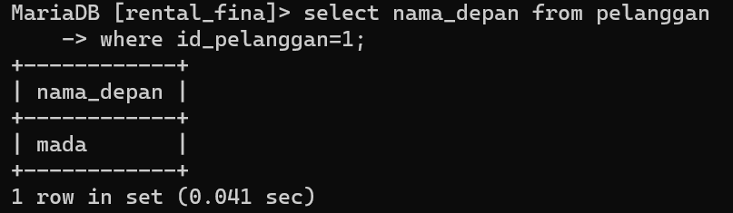
### Analisis
 - `Select` merupakan query yang digunakan untuk menampilkan hasil `insert`
- `id_pelanggan,nama_depan` nama kolom dalam tabel database yang mungkin menyimpan informasi tentang nama depan dari pelanggan.
- `from` query yang digunakan untuk memberikan penanda bahwa table mana yang akan di tampilkan
- `pelanggan` merupakan nama table yang isi nya akan di tampilkan
- `where` untuk menyaring baris data berdasarkan kondisi tertentu.
- `id_pelanggan=1` hanya baris-baris data di mana nilai kolom
### Kesimpulan
hasilnya akan berisi ID dan nama depan pelanggan yang memiliki ID tertentu
# Update
## Struktur
```mysql
mysql> UPDATE nama_tabel SET nama_kolom WHERE kondisi;
```
## Contoh 
```mysql
 UPDATE pelanggan SET no_telp="085358639358" WHERE id_pelanggan="1";
```
## Hasil
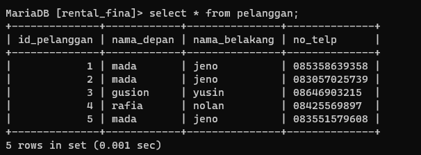
## Analisis
- `UPDATE pelanggan`: Ini adalah klausa yang menentukan tabel mana yang akan diperbarui. Dalam kasus ini, tabel yang diperbarui adalah "pelanggan".
- `SET no_telp="085358639358"`: Ini adalah klausa yang menentukan kolom mana yang akan diperbarui dan nilai baru yang akan diberikan. Dalam hal ini, kolom yang diperbarui adalah "no_telp" dan nilainya diubah menjadi "085358639358".
- `WHERE id_pelanggan="1"`: Ini adalah klausa opsional yang digunakan untuk membatasi baris mana yang akan diperbarui. Dalam hal ini, perubahan hanya akan diterapkan pada baris dengan nilai "id_pelanggan" yang sama dengan "1".
## Kesimpulan
nomor telepon (no_telp) dari pelanggan dengan ID "1" akan diubah menjadi "085358639358". Perintah tersebut mengupdate data pada tabel "pelanggan" dan mengaplikasikan perubahan hanya pada baris dengan nilai "id_pelanggan" yang sama dengan "1".
# Delete
## Struktur 
```mysql
DELETE FROM nama_tabel WHERE kondisi;
```
## Contoh
```mysql
DELETE FROM pelanggan WHERE id_pelanggan="2";
```
## Hasil
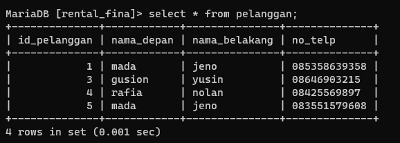
## Analisis
- `DELETE FROM pelanggan`: Ini adalah klausa yang menentukan tabel mana yang akan dihapus datanya. Dalam kasus ini, data akan dihapus dari tabel "pelanggan".
- `WHERE id_pelanggan="2"`: Ini adalah klausa opsional yang digunakan untuk membatasi baris mana yang akan dihapus. Dalam hal ini, baris dengan nilai "id_pelanggan" yang sama dengan "2" akan dihapus.
## Kesimpulan
jika ingin menghapus baris table kalian bisa menggunakan query `delete` dengan struktur yaitu `delete from nama_table where kondisi;` 
# Hapus Tabel
## Struktur Query
```mysql
drop table [nama_tabel]
```
## Contoh Query
```mysql
drop table mobil;
```
## Hasil

## Analisis
- `"DROP TABLE"` : Ini adalah perintah SQL yang digunakan untuk menghapus sebuah tabel dari basis data.
- `"mobil"` : Ini adalah nama tabel yang ingin Anda hapus. Dalam kasus ini, tabel yang bernama "mobil" akan dihapus.
## Kesimpulan
`"DROP TABLE"` adalah perintah yang digunakan untuk menghapus tabel dari sebuah basis data.
